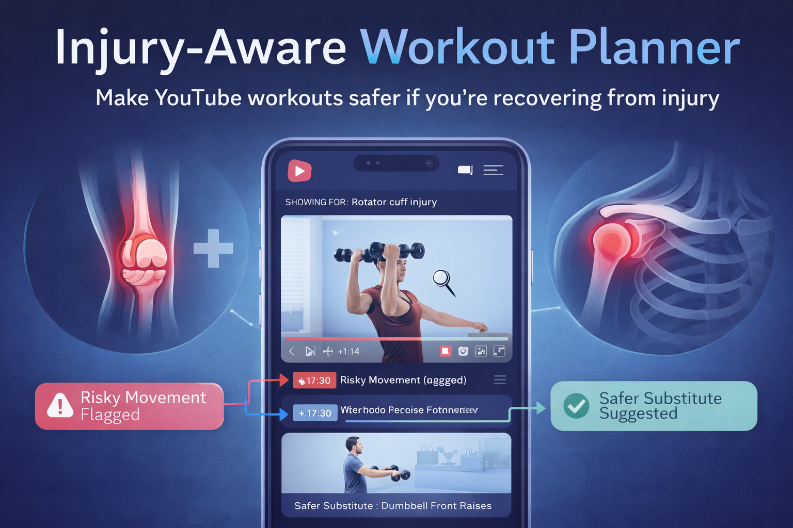

<div align="center">

# AdaptFit AI

**Injury-aware workout adaptation for safer self-directed training**

AdaptFit AI helps people modify existing workouts around injury context. The app collects profile and recovery signals, analyzes a YouTube workout or pasted plan, flags risky movements, and suggests safer alternatives.

**Input:** injury context + YouTube link or pasted workout text  
**Output:** risk labels + safer substitutions + time-aware workout modification

<p align="center">
  
</p>

</div>

## Project Overview

Musculoskeletal injuries often leave active people in an awkward middle ground: they may be cleared for some movement, but they still need to avoid exercises that could aggravate pain, overload healing tissue, or rush return-to-sport progression. Most consumer fitness apps optimize for performance and adherence, while rehabilitation tools usually provide fixed clinical exercise programs. AdaptFit AI sits between those worlds.

The system is designed as a support tool, not a medical replacement. It focuses on mid-stage recovery and everyday workout adaptation: users can keep following familiar workout content while receiving injury-aware warnings and substitutions.

## Core Features

- **Structured onboarding:** collects basic profile, activity level, injury location, diagnosis/context, pain levels, functional screening, movement limitations, and goals.
- **Recovery readiness framing:** helps decide whether a user should proceed cautiously or pause and seek professional support.
- **YouTube workout adaptation:** builds a segmented workout representation from video metadata and generated timeline information.
- **Text workout adaptation:** supports pasted workout plans when video analysis is not needed.
- **Risk-labeled substitutions:** returns each original movement with a `Low`, `Medium`, or `High` risk flag and a safer alternative when needed.
- **Saved analysis flow:** the deployable MVP supports authentication and stored user/workout analysis history through Supabase.

## Target Users

- People recovering from common musculoskeletal injuries such as ACL reconstruction, meniscal repair, patellofemoral pain, knee osteoarthritis, rotator cuff injury, shoulder impingement, ankle sprain, and lower-back discomfort.
- Fitness-conscious users who want to continue using YouTube workouts or existing training plans.
- Users in mid-stage rehabilitation who are not in an acute protection phase but still need symptom-aware exercise modification.
- Recreational athletes, dancers, runners, hikers, and gym users who need safer return-to-activity guidance.

## How It Works

1. **User completes onboarding**
   - Basic profile
   - Injury details
   - Pain and functional screening
   - Activity level and goals

2. **User imports a workout**
   - YouTube URL
   - Pasted workout text

3. **Backend normalizes inputs**
   - Stores a session
   - Converts user survey answers into `user_input_data`
   - Converts workout content into a structured workout/video information object

4. **AI adaptation pipeline runs**
   - Reviews each workout segment against the injury profile
   - Assigns a risk label
   - Suggests safer alternatives for higher-risk movements

5. **User reviews results**
   - Original movement
   - Risk flag
   - Modified alternative
   - Time ranges when video segments are available

## Repository Structure

```text
.
|-- adaptfit_app.html              # Single-file local demo
|-- app/                           # Local FastAPI demo backend and AI prompt flow
|-- backend/                       # Earlier modular backend prototype
|-- deploy-app/                    # Deployable MVP frontend + FastAPI backend
|-- docs/                          # Final report, evaluation data, visuals, use cases
|-- literature/                    # CP1 literature sources
|-- proposal/                      # Initial proposal
|-- validation/                    # AI-tool validation and user/expert interviews
|-- reflection/                    # Literature reflection notes
|-- DESIGN_SPEC.md                 # Product flows, screens, requirements
|-- requirements.txt               # Python dependencies
|-- vercel.json                    # Vercel configuration
```

## Key Artifacts

- [Final Report](docs/final_report.md)
- [Design Specification](DESIGN_SPEC.md)
- [Use Cases and Test Plan](docs/use-cases.md)
- [AI Tool Validations](validation/AI-tool-validations.md)
- [User and Expert Interviews](validation/interviews.md)
- [SUS-Lite 5 Chart (mean +/- SD, n=21)](docs/sus_lite_5_mean_sd.png)

## Deployable MVP

The current deployable app lives in `deploy-app/`.

### Frontend pages

- `index.html` - sign in / sign up
- `onboarding-basic.html` - basic profile
- `onboarding-injury.html` - body part and diagnosis
- `onboarding-assessment.html` - pain, timeline, and screening
- `onboarding-goals.html` - goals and activity level
- `workouts.html` - YouTube or pasted workout import
- `results.html` - saved analysis results

### Backend endpoints

- `GET /health`
- `POST /api/survey`
- `POST /api/readiness/explain`
- `POST /api/adapt/workout`

The deployable backend is exposed through `deploy-app/api/index.py`, which imports the FastAPI app from `deploy-app/backend/server.py`.

## Local Setup

### 1. Install Python dependencies

```powershell
pip install -r requirements.txt
```

### 2. Run the local demo backend

```powershell
py -m uvicorn app.server:app --reload --port 8010
```

Then open `adaptfit_app.html` in a browser or serve the project folder locally.

### 3. Run the deployable frontend locally

```powershell
cd deploy-app
py -m http.server 4173
```

Open:

```text
http://127.0.0.1:4173
```

For local static hosting, set `API_BASE` in `deploy-app/assets/js/config.js` to the backend URL. For Vercel, leave `API_BASE` blank so the frontend uses same-origin `/api`.

### 4. Configure optional services

The deployable MVP can use:

- **Supabase** for authentication and persistence
- **Gemini/Groq API keys** for workout analysis and readiness explanations

Use `deploy-app/README.md` for the deploy-specific Supabase setup notes.

## Evaluation Summary

The project was evaluated through:

- CP1 literature review on rehabilitation, AI exercise recommendation, injury prevention, and workout video support
- AI-tool validation across common LLM and injury-app workflows
- Interviews with medical professionals, a physiotherapist, and injury-experienced users
- A 21-response structured persona evaluation with Likert and qualitative questions

Key quantitative findings from the 21-response evaluation:

| Evaluation item | Mean | SD |
| --- | ---: | ---: |
| Support-tool clarity | 4.57 | 0.60 |
| Pause/consult clarity | 4.29 | 0.64 |
| Workflow ease | 4.33 | 0.58 |
| Assessment relevance | 4.43 | 0.75 |
| Reduced modification effort | 4.29 | 0.78 |

Overall, users found the workflow understandable, valued the injury assessment, and felt the app reduced the effort of figuring out which exercises to skip or modify. The main improvement areas are stronger risk explanations, clearer risk-to-action guidance, sport-specific context, and stricter escalation for high-risk symptoms.

## Safety and Ethics

AdaptFit AI is not a diagnostic tool, physical therapist, or medical device. It should be treated as a decision-support prototype for workout planning.

Safety principles:

- Keep recommendations conservative when pain, recent injury, or uncertainty is high.
- Explain why an exercise is risky and why an alternative is safer.
- Prompt users to pause and consult a professional for severe, worsening, unclear, post-surgical, or neurologic symptoms.
- Minimize sensitive data collection and avoid unnecessary personally identifiable information.
- Use expert review before claiming clinical safety or effectiveness.

## Limitations

- Current evaluation is formative and persona-based, not clinical validation.
- The system relies on self-reported pain, injury context, and functional screening.
- The app does not assess exercise form, range of motion, load, fatigue, or biomechanics in real time.
- YouTube segmentation and timestamp accuracy can still fail.
- LLM output requires guardrails, validation, and conservative fallback behavior.
- Sport-specific return-to-play needs more detailed screening and progression logic.

## Future Work

- Add an explicit rule layer connecting injury type, recovery stage, pain, and movement category to safer actions.
- Expand red-flag screening and professional escalation logic.
- Improve explanations for each risk label and substitution.
- Add activity-specific modules for running, football, dance, hiking, tennis, and return-to-sport progression.
- Validate recommendations with clinicians and compare outputs against expert-created modifications.
- Add longitudinal feedback for adherence, pain response, and progression.

## Team Roles

- **Vinit Agrharkar:** Software development, backend, AI workflow, deployment support
- **Emma Zou:** Problem framing, literature synthesis, validation support
- **Yuyang Liu:** Competitive analysis, literature and video-analysis research
- **Prisha Singhania:** Concept framing, value proposition, user validation support

## References and Report

The full APA-style reference list, appendices, evaluation materials, prompt summary, and detailed discussion are available in the [final report](docs/final_report.md).
