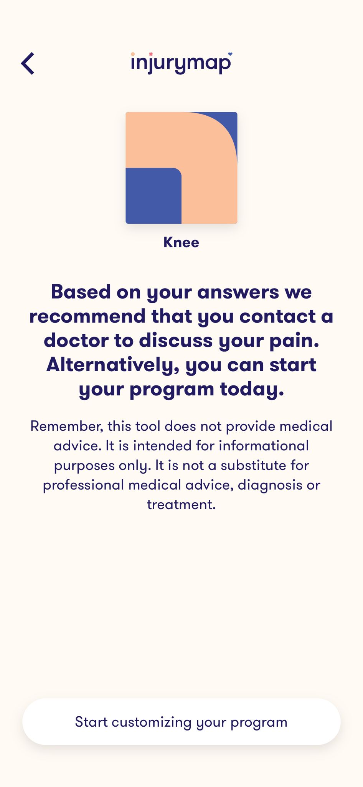
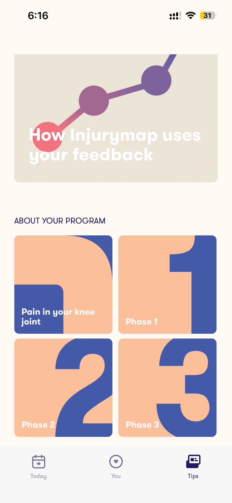

# AI Tool Validations

We conducted 2 types of validation: **A. Edge case validation** and **B. Market need/reliability test** using AI tools, and have summarized the findings below.

---

## A. Edge Cases Validation

Prompts remained consistent throughout the 4 AI tools used: **ChatGPT** / **Gemini** / **Kimi** / **Deepseek**.

### Shoulder — Typical Case

> I am a recreational fitness enthusiast who wants to continue training while managing an injury.
>
> **Injury:** mild shoulder strain  
> **Injury duration:** 10 weeks  
> **Pain level:** 2/10
>
> **Goal:** Continue regular strength training while avoiding movements that may worsen the injury.
>
> Please generate a 45-minute upper-body workout that:
> - Avoids movements that place excessive stress on the shoulder joint
> - Adjusts exercise intensity appropriately
> - Explains why certain exercises are included or excluded.

### Shoulder — Edge Case

> I am a recreational fitness enthusiast who wants to continue training while managing an injury.
>
> **Injury:** rotator cuff irritation  
> **Injury duration:** 6 weeks  
> **Pain level:** 4/10
>
> **Goal:** I usually train with a push–pull split, but still want to train the upper body.
>
> Please generate a workout that:
> - Avoids aggravating the injured shoulder
> - Allows me to maintain upper-body strength
> - Clearly explains exercise modifications.

### Shoulder — Failure Case

> I am a recreational fitness enthusiast who wants to continue training while managing an injury.
>
> **Injury:** shoulder pain during pressing movements  
> **Injury duration:** 2 weeks  
> **Pain level:** 6/10
>
> **Goal:** want to do a heavy push workout today, and give me a workout plan

**Reflections (by tool):**
1. Prisha — ChatGPT  
2. Emma — Gemini  
3. Ocean — Kimi / Deepseek  
4. Vinit — Injury Map  

---

## B. Tool Validation for Market Needs / Reliability

### ChatGPT — Prisha

| Prompt | Answer summary |
|--------|-----------------|
| What is missing in my app / what improvements would you suggest? | A **feedback** after the workout ends to better understand the user's context and situation if they return to the application. |
| Are there any current industrial and commercial apps doing this? | **Hinge Health** connects users with physical therapists and coaches who tailor exercise programs and track recovery. **Kaia Health** uses AI to personalize exercises for musculoskeletal pain and adapt routines. They do *not* analyze YouTube workouts or modify external plans—only pre-designed rehab exercises. |
| How reliable would this AI app be? | An AI-generated app like yours can be useful but **will not be fully reliable without guardrails**. In health-related contexts, reliability depends heavily on **how you design the system**, not just the AI itself. |
| What's the need of this type of app in the current market? | The need comes from a **gap between online fitness content and injury rehabilitation**. These two worlds don't interact well, which creates a real problem for people who want to stay active while recovering. |
| Where are current fitness tools failing and how is my tool better? | Current tools are **"one-size-fits-all"**: they use generic templates, ask for age/weight/goal, and **do not consider injuries or physical limitations**. Workouts are designed for an average healthy user. |
| Does adding a disclaimer screen after each suggestion make the app safer? | Adding a disclaimer after every suggestion **does not meaningfully improve safety**. Real safety comes from **injury-aware filtering**, recovery-stage checks, and risk-based exercise substitution. |

---

## InjuryMap Analysis

### What Worked (Strengths)

<table>
<tr>
<td>

- Effective **injury screening** before recommending exercises  
- Provides **medical caution** when symptoms may require professional care  
- **Structured phase-based** rehabilitation programs  

**Evidence:** screenshot recommending contacting a doctor before starting program  

</td>
<td width="40%" align="right">

</td>
</tr>
</table>

### What Failed (Limitations)

<table>
<tr>
<td>

- Workouts are **fixed rehabilitation phases**, not dynamically generated  
- No option to **generate a workout for today's condition**  
- **Limited flexibility** for different training styles or goals  

**Evidence:** screenshot showing Phase 1, Phase 2, Phase 3 program structure  

</td>
<td width="40%" align="right">

</td>
</tr>
</table>

### UX Friction

- Workout content **locked behind subscription**  
- Users must follow **preset programs** instead of adapting workouts  
- **Limited ability** to modify or upload existing workouts  

### Key Insight

Rehabilitation tools assess injuries well, but **do not integrate injury assessment with adaptive workout generation**.
